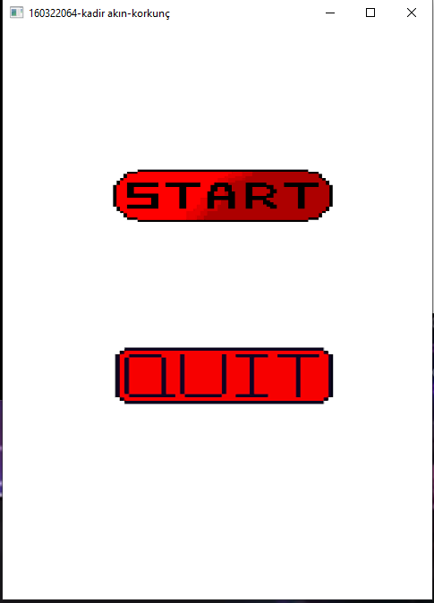
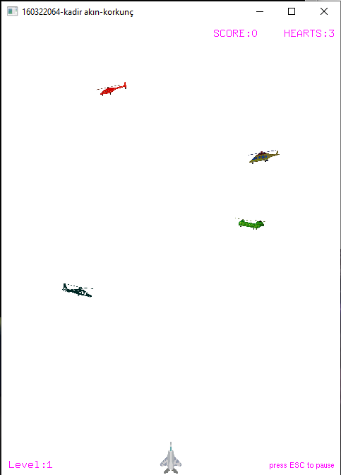
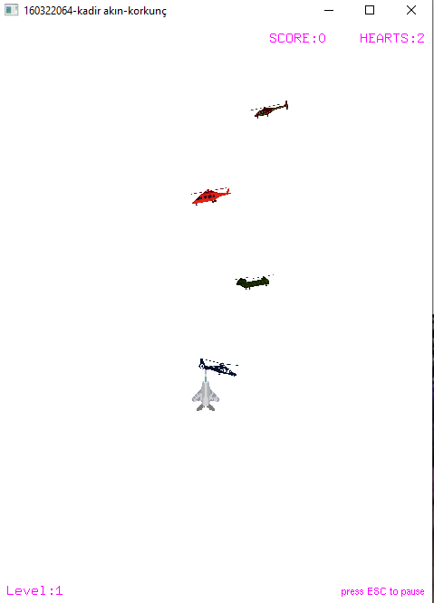
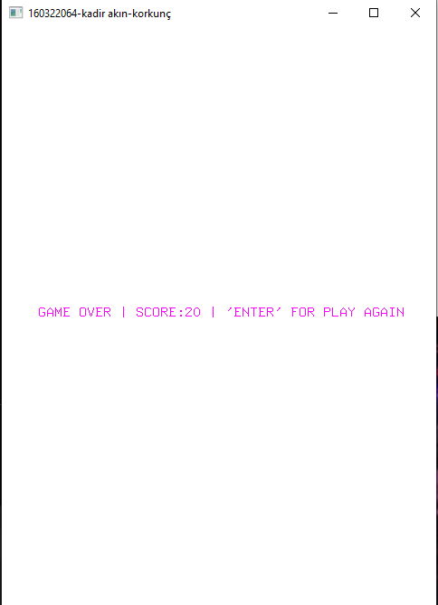

# reach to the target game
## originally developed for "Computer Graphics" course.

I received theoretical training on how an object can be represented in a digital environment. A two-dimensional game development target has been set in order to find a response to the learned information.

In project scope; 1 plane appearing in a random position in an area of ​​480x240 on the screen window and 4 helicopters in an area of ​​480x420 were drawn. It is aimed to reach the end of the window by avoiding the contact of the aircraft with the helicopter, which depends on user interaction, by appearing randomly from the right or left on the horizontal axis and moving in a continuous flow. The user has the right to play a game session 3 times. At each collision, 1 right is deducted. For each successful crossing, the user earns 10 points. The screen displays the score and the number of remaining points. When the number of rights reaches zero, the interaction ends and the user's results are reflected to him and the input is awaited to play again. Project includes background music and occasion spesific sound effects.  
Photos;

  
 
 
